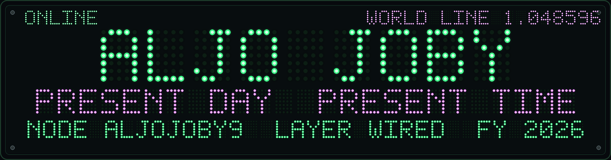
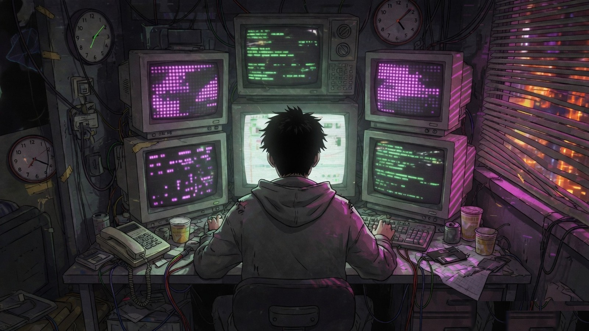

<!--
  present day, present time.
  layer  :: WIRED
  node   :: aljojoby9
  magi   :: MELCHIOR / BALTHASAR / CASPER
  konami :: ↑↑↓↓←→←→BA
  el psy kongroo
-->

<p align="center">
  
</p>

<p align="center">
  
</p>

<p align="center">
  
</p>

<p align="center">
  
</p>

<h1 align="center">aljo@wired:~$</h1>

<p align="center">
  
</p>

<p align="center">
  
  
  
  
  <a href="https://github.com/twbs/bootstrap/pulls?q=is%3Apr+author%3Aaljojoby9"></a>
  
</p>

```text
┌─ NAVI / LAYER:WIRED / NODE:aljojoby9 / FY2026 ─────────────────────────┐
│                                                                        │
│  $ whoami                                                              │
│  Aljo Joby · CSE · systems security                                    │
│                                                                        │
│  $ cat /proc/specialization                                            │
│  XSS / DOM sanitization · srcset URL validation · fail-closed parsers  │
│  JS/TS · defensive web · OSS                                           │
│                                                                        │
│  $ magi --consensus                                                    │
│  MELCHIOR   js/ts  ·  bootstrap sanitizer  ·  vercel ai sdk            │
│  BALTHASAR  xss    ·  data:/vbscript: blocks  ·  collapse state        │
│  CASPER     oss    ·  opencog ecan  ·  agentic tooling                 │
│                                                                        │
│  $ echo $SHELL                                                         │
│  /usr/bin/the_wired                                                    │
└────────────────────────────────────────────────────────────────────────┘
```

I live on the request/response boundary. Most of my open source time is spent making HTML sanitizers **fail closed** — `srcset`, `data:`, `vbscript:`, icon options that thought they were strings. The rest is developer tools, a little AGI-adjacent graph code, and whatever still compiles on a CRT in 2026.

<p align="center">
  
</p>

## `./stack`

<p align="center">
  
</p>

```text
languages   JS/TS · Python · Kotlin · C/C++ · Java
domain      defensive DOM · XSS · sanitizer hardening
current     @twbs/bootstrap sanitizer + AI SDK providers
watchlist   agentic tooling · fail-closed parsers · the Wired
```

<p align="center">
  
</p>

## `./patches`  —  twbs/bootstrap

XSS in a UI kit is a ghost in the shell. These are the ones I filed:

| status | patch | what it actually does |
| :---: | --- | --- |
| open | [srcset URL validation, fail closed without DOMParser](https://github.com/twbs/bootstrap/pull/42840) | sanitizer refuses to guess |
| open | [block `data:` / `vbscript:` URLs](https://github.com/twbs/bootstrap/pull/42806) | XSS hardening |
| open | [collapse trigger state after hide](https://github.com/twbs/bootstrap/pull/42664) | UI state vs. reality |
| merged | [sanitize HTML icon options](https://github.com/twbs/bootstrap/pull/42805) | chips / nav overflow |

<p align="center">
  
</p>

## `./src`

| node | payload | lang |
| --- | --- | --- |
| [krutrim-ai-sdk](https://github.com/aljojoby9/krutrim-ai-sdk) | Krutrim Cloud provider for the Vercel AI SDK — India's sovereign models, normal DX | TypeScript |
| [hyperon-ecan](https://github.com/aljojoby9/hyperon-ecan) | Economic Attention Networks for OpenCog Hyperon; spreading activation along embeddings | Python |
| [Turing-interpreter](https://github.com/aljojoby9/Turing-interpreter) | a Turing machine you can actually run | C |
| [QuickShare](https://github.com/aljojoby9/QuickShare) | local sharing, Kotlin-side | Kotlin |
| [maze_pathfinder](https://github.com/aljojoby9/maze_pathfinder) | graphs, grids, the long way around | Python |
| [MedicalRAG](https://github.com/aljojoby9/MedicalRAG) | retrieval-augmented answers, not vibes | Python |

<p align="center">
  
</p>

## `./proc/stats`

<p align="center">
  
  
</p>

<p align="center">
  
</p>

<p align="center">
  
</p>

<details>
<summary><code>magi --dump</code> // classified, low-clearance</summary>

```text
operator     aljojoby9
class        CSE
protocol     WIRED
special      XSS / DOM / sanitizer
affiliation  contributor @twbs/bootstrap
wm           phosphor green / magenta
anime_refs   Serial Experiments Lain
             Ghost in the Shell SAC
             Steins;Gate 1.048596
             Cowboy Bebop (footer only)
motto        fail closed. don't leak the ghost.
uptime       compiling since 2023-08-08
```

</details>

<p align="center">
  
</p>

## `./worm`  —  contribution snake

<p align="center">
  <picture>
    <source media="(prefers-color-scheme: dark)" srcset="https://raw.githubusercontent.com/aljojoby9/aljojoby9/output/github-contribution-grid-snake-dark.svg" />
    <source media="(prefers-color-scheme: light)" srcset="https://raw.githubusercontent.com/aljojoby9/aljojoby9/output/github-contribution-grid-snake.svg" />
    
  </picture>
</p>

---

<p align="center">
  <code>the net is vast and infinite.</code><br/>
  <sub>see you, space cowboy...</sub>
</p>
